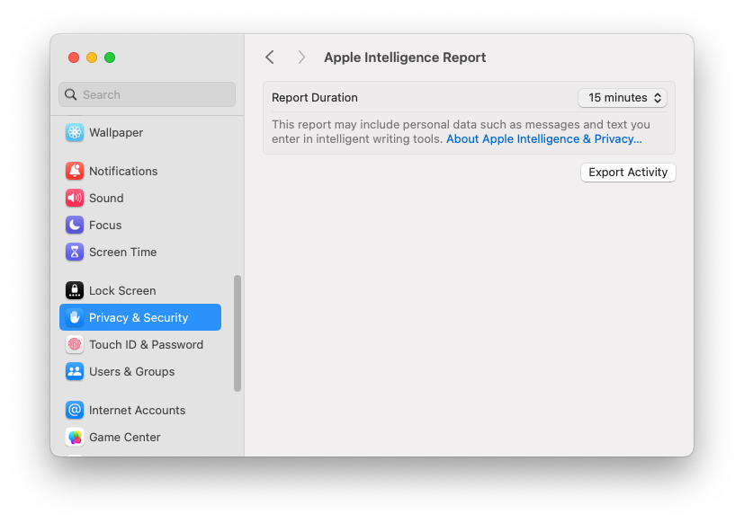

---

For my Master's thesis, I spent almost half a year investigating Apple Intelligence and Private Cloud Compute.
I started my thesis in October 2024, when Apple Intelligence was still very young and not even available on iPhones in the EU.
The security/privacy issue I discovered and describe here is – to the best of my knowledge – the first issue in the context of Apple Intelligence ever acknowledged and fixed by Apple.

## Security & Transparency

Apple gladly portrays itself as a privacy-focused company and as such, processing Apple Intelligence requests in the cloud in plaintext is a tricky undertaking.
Its cloud infrastructure – Private Cloud Compute (PCC) – therefore also comes with [specific promises](https://security.apple.com/blog/private-cloud-compute/) towards user privacy and security.
One of these is _transparency_: users must be able to see which requests are processed on PCC and what data is sent there.
While it is sadly not possible to check this beforehand or disable cloud processing entirely, there is at least a way to find it out afterward.
That's where Apple Intelligence Reports come in.

## Apple Intelligence Reports (AIRs)

AIRs are enabled by default and set to capture the last 15 minutes.
It is also possible to set the time window to 7 days or turn the logging off entirely in _System Settings_ > _Privacy & Security_ > _Apple Intelligence Report_.

To obtain the report, we must click the _Export Activity_ button in the settings and are prompted to choose a location where the JSON file should be saved.



Here is an example of an AIR that I exported after summarizing an email:

```json{linenos=true}
{
  "modelRequests": [
    {
      "timestamp": 1730558807.610649,
      "identifier": "A8FB7E88-AF7F-4F0D-A3A1-9FA6018EA002",
      "prompt": "PromptTemplateInfo(templateID: \"com.apple.SummarizationKit.mailMessage.synopsis\", 
      variableBindings: [\"context\": \"\", \"doc\": \"Subject: Computers<n>
      Body: This is the text of the email for which I requested a summary.\"], 
      locale: Optional(en_US@rg=dezzzz (autoupdating en_US@rg=dezzzz)))",
      "response": "The summary created by Private Cloud Compute",
      "model": "com.apple.fm.language.instruct_server_v1.text_summarizer",
      "modelVersion": "8.0.0",
      "clientIdentifier": "com.apple.mobilemail",
      "executionEnvironment": "PrivateCloudCompute"
    }
  ],
  "privateCloudComputeRequests": [
    {
      "timestamp": 1730558807.6208658,
      "requestId": "A8FB7E88-AF7F-4F0D-A3A1-9FA6018EA002",
      "pipelineKind": "tie-cloudboard-apple-com",
      "pipelineParameters": "{\"adapter\":\"com.apple.fm.language.instruct_server_v1.text_summarizer\",
      \"apple-tokenizer-name\":\"com.apple.fm.language.instruct_server_v1.tokenizer\",
      \"input-token-count-interval-end-open\":\"3250\",\"input-token-count-interval-start-closed\":\"3000\",
      \"max-allowed-output-tokens-interval-end-open\":\"315\",\"max-allowed-output-tokens-interval-start-closed\":\"300\",
      \"model\":\"com.apple.fm.language.instruct_server_v1.base\"}",
      "nodes": [
        {
            "node": "N9jbQJjQFqrEs+7jorGPAYU14ApYHfuehs2ER8GCtYE=",
            "nodeState": "Validated",
            "attestationBundle": "{\"sepAttestation\":\"MIIFHTCCBKQCAQEwggJPoh8EHTYwMjItMjIwNTgxMTI5YTAxZKE..."
        }
      ]
    }
  ]
}
```

So, there are essentially two things included in such an AIR: the request prompt with the generated response, and details on the PCC node that handled the request.
As you can see in line 8, the prompt also contains potentially sensitive data, in this case the subject and body of the email.

## The Issue

During my investigation, I wanted to find out where all this request data is being stored, so that it can be collected and exported as an AIR later.
For that, I had the `fs_usage` tool running while I navigated through the steps of exporting the report.&nbsp;[^1]
Going through the recorded logs, I noticed a file called `Apple_Intelligence_Report.json` being written to the path `/private/var/folders/vg/<random>/T`, even though I didn't actually choose a location in the settings, but instead selected _Cancel_.

This directory, as I later found out, is just the user's home directory and defined in the `$TMPDIR` environment variable or easily accessible in Swift through:

```swift
FileManager.default.temporaryDirectory
```

As such, this path is readable and writable by any application which runs with user-level permissions (i.e., almost all apps) and which isn't sandboxed (i.e., most apps on macOS).&nbsp;[^2]

## Potential Impact

The impact is obvious: a malicious app installed on the user's Mac could routinely check the user's temporary directory for the AIR file and extract potentially sensitive information from it.
The file is present there until the device is restarted – a simple logout and re-login doesn't clear the directory.
However, user interaction is still required in some form, as the user first needs to click the _Export Activity_ button, which I suppose only few people actually do.

---

## Responsible Disclosure Timeline

- February 12, 2025: Discovered the issue
- February 13, 2025: Discussed it with my supervisor and reported the issue to Apple
- a few days later: Apple reproduced the issue
- April 8, 2025: Apple plans to release a fix in spring 2025
- May 12, 2025: macOS 15.5 is released, fixing the issue

Unfortunately, I did not receive a bounty from Apple.


[^1]: It turned out the _Biome_ subsystem is responsible for this. [hoakley](https://eclecticlight.co/2022/06/27/biome-isnt-about-biometrics-but-suggestions/) wrote a very good overview of _Biome_ a while back.
[^2]: This second requirement is also the reason why iOS and iPadOS aren't affected by this issue, because all apps installed there must be sandboxed and thus have their own temporary directory.